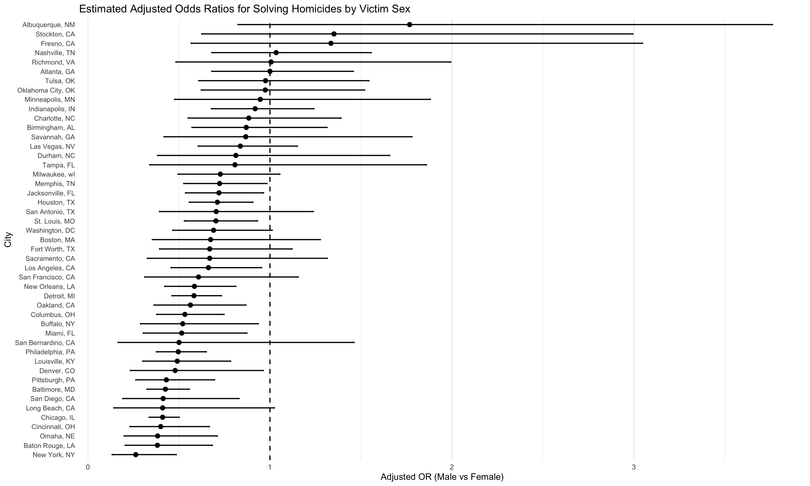
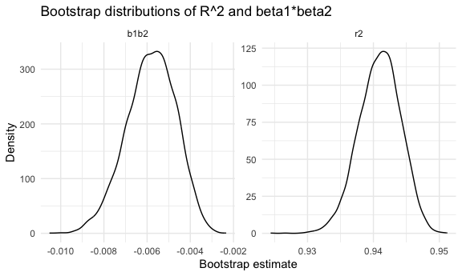
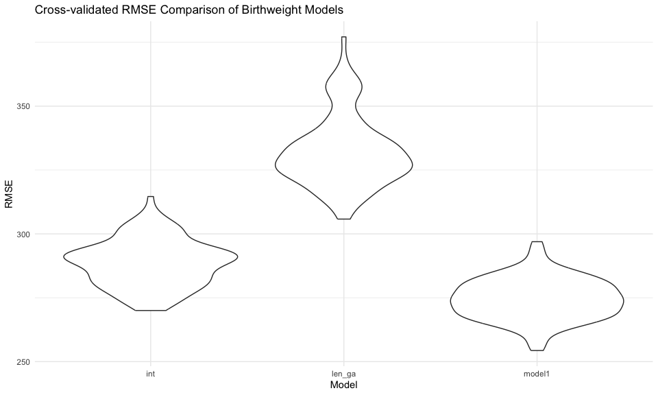

p8105_hw6_zx2527
================
Zihan Xiong
2025-12-03

# Problem 1

## Import data

``` r
homi_raw=read.csv("./data/homicide-data.csv",na=c("NA", "0", "")) |>
  janitor::clean_names() 
```

``` r
homi_clean<- homi_raw |>
  mutate(
    city_state=paste(city,state,sep=", "),
    solved=if_else(disposition=="Closed by arrest", 1, 0)
  ) |>
  filter(
    !(city_state=="Dallas, TX"),
    !(city_state=="Phoenix, AZ"),
    !(city_state=="Kansas City, MO"),
    !(city_state=="Tulsa, AL")
  ) |>
  filter(
    victim_race %in% c("White","Black")
  ) |>
  mutate(
    victim_age=as.numeric(victim_age)
  )
```

## Baltimore

``` r
balt <- homi_clean |>
  filter(city_state=="Baltimore, MD")

fit_balt <- glm(
  solved~victim_age+victim_sex+victim_race,
  data = balt,
  family = binomial
)

res_balt <- tidy(fit_balt, exponentiate = TRUE, conf.int = TRUE) |>
  filter(term == "victim_sexMale")

knitr::kable(res_balt)
```

| term           |  estimate | std.error | statistic | p.value |  conf.low | conf.high |
|:---------------|----------:|----------:|----------:|--------:|----------:|----------:|
| victim_sexMale | 0.4433236 | 0.1395075 | -5.830908 |       0 | 0.3369504 | 0.5825366 |

Estimate adjusted odds ratio: 0.44 Confidence interval: (0.34, 0.58)

## Other cities building function, then loop iteration

``` r
glm_solved=function(df){
  glm(solved~victim_age + victim_sex + victim_race,
      data = df, family = binomial)
}
```

``` r
city_glm_results=
  homi_clean |>
  group_by(city_state) |>
  nest() |>
  mutate(
    fits=map(data, glm_solved),
    results=map(fits, ~tidy(.x, exponentiate= TRUE, conf.int = TRUE))
  ) |>
  select(city_state, results) |>
  unnest(results) |>
  filter(term=="victim_sexMale") |>
  arrange(estimate)
```

## Make plot

``` r
ggplot(city_glm_results,
       aes(x=reorder(city_state, estimate),
           y=estimate))+
  geom_point() +
  geom_errorbar(aes(ymin = conf.low, ymax = conf.high),
                width=0.15)+
  geom_hline(yintercept = 1, linetype=2)+
  coord_flip()+
  labs(
    x = "City",
    y = "Adjusted OR (Male vs Female)",
    title = "Estimated Adjusted Odds Ratios for Solving Homicides by Victim Sex"
  )+
  theme_minimal(base_size = 8) +
  theme(
    axis.text.y = element_text(size = 6),  
    panel.grid.major.y = element_blank()   
  )
```



Most cities show lower odds of solving homicides involving male victims
compared to female victims (OR \< 1), even after adjusting for age and
race. However, the strength of this disparity varies by city, with some
locations showing much wider confidence intervals due to smaller sample
sizes.

## Problem 2

``` r
library(p8105.datasets)
data("weather_df")

weather_clean =
  weather_df |>
  drop_na(tmax, tmin, prcp)
```

look at the data first

``` r
weather_clean |>
  lm(tmax~tmin+prcp, data=_) |>
  broom::glance() |>
  knitr::kable(digits = 3)
```

| r.squared | adj.r.squared | sigma | statistic | p.value | df | logLik | AIC | BIC | deviance | df.residual | nobs |
|---:|---:|---:|---:|---:|---:|---:|---:|---:|---:|---:|---:|
| 0.941 | 0.941 | 2.73 | 17244.74 | 0 | 2 | -5258.956 | 10525.91 | 10548.64 | 16151.98 | 2168 | 2171 |

write a function

``` r
weather_stats=function(df){
  fit=lm(tmax~tmin+prcp, data=df)
  
  g=broom::glance(fit)
  coef_df=broom::tidy(fit)
  
  r2=g$r.squared
  
  b1 = coef_df |> 
    filter(term == "tmin") |> 
    pull(estimate)
  
  b2 = coef_df |> 
    filter(term == "prcp") |> 
    pull(estimate)
  
  tibble(
    r2   = r2,
    b1_over_b2 = b1 / b2
  )
}
```

check

``` r
weather_stats(weather_df)
```

    ## # A tibble: 1 × 2
    ##      r2 b1_over_b2
    ##   <dbl>      <dbl>
    ## 1 0.941      -182.

### Use 5000 samples bootstrap

``` r
set.seed(1)

weather_bootstrap=
  weather_clean |>
  bootstrap(n=5000) |>
  mutate(
    df = map(strap, as_tibble),
    results = map(df, weather_stats)
  ) |>
  select(.id, results) |>
  unnest(results)
```

### make plot

``` r
weather_bootstrap_long = 
  weather_bootstrap |> 
  pivot_longer(
    cols = c(r2, b1_over_b2),
    names_to = "stat",
    values_to = "value"
  )
```

``` r
weather_bootstrap_long |> 
  ggplot(aes(x = value)) + 
  geom_density() + 
  facet_wrap(~ stat, scales = "free") +
  labs(
    x = "Bootstrap estimate",
    y = "Density",
    title = "Bootstrap distributions of R^2 and beta1/beta2"
  )
```



The bootstrap distribution of R^2 is approximately symmetric and tightly
concentrated around 0.94. This suggests that the regression model
consistently explains a high proportion of the variation in maximum
temperature, with relatively low uncertainty in this estimate.

In contrast, the distribution of beta1_over_beta2 is highly left-skewed,
with a long tail extending toward more negative values. This reflects
substantial instability in the coefficient ratio, likely due to the
small and variable estimated effect of precipitation in the model. As a
result, inference for this quantity is considerably more uncertain.

### Calculate 95%CI

``` r
weather_bootstrap_long |> 
  group_by(stat) |> 
  summarize(
    ci_lower = quantile(value, 0.025),
    ci_upper = quantile(value, 0.975)
  ) |> 
  knitr::kable(digits = 4)
```

| stat       |  ci_lower |  ci_upper |
|:-----------|----------:|----------:|
| b1_over_b2 | -274.7945 | -125.4836 |
| r2         |    0.9345 |    0.9467 |

## Problem 3

### Import data

``` r
bw_raw = read_csv("./data/birthweight.csv") |>
  janitor::clean_names() 
```

    ## Rows: 4342 Columns: 20
    ## ── Column specification ────────────────────────────────────────────────────────
    ## Delimiter: ","
    ## dbl (20): babysex, bhead, blength, bwt, delwt, fincome, frace, gaweeks, malf...
    ## 
    ## ℹ Use `spec()` to retrieve the full column specification for this data.
    ## ℹ Specify the column types or set `show_col_types = FALSE` to quiet this message.

``` r
bw_clean =
  bw_raw |>
  mutate(
    babysex=factor(babysex,
                   levels = c(1,2),
                   labels = c("male","female")),
    malform=factor(malform,
                   levels = c(0,1),
                   labels = c("absent","present")),
    mrace=factor(mrace,
                 levels = c(1,2,3,4,8),
                 labels = c("white","black","asian","puerto_rican","other")),
    frace=factor(frace,
                 levels =c(1,2,3,4,8,9),
                 labels = c("white","black","asian","puerto_rican","other","unknown"))
  ) |>
  drop_na()
```

``` r
bw_clean |> summarise(across(everything(), ~sum(is.na(.))))
```

    ## # A tibble: 1 × 20
    ##   babysex bhead blength   bwt delwt fincome frace gaweeks malform menarche
    ##     <int> <int>   <int> <int> <int>   <int> <int>   <int>   <int>    <int>
    ## 1       0     0       0     0     0       0     0       0       0        0
    ## # ℹ 10 more variables: mheight <int>, momage <int>, mrace <int>, parity <int>,
    ## #   pnumlbw <int>, pnumsga <int>, ppbmi <int>, ppwt <int>, smoken <int>,
    ## #   wtgain <int>

``` r
nrow(bw_clean)
```

    ## [1] 4342

### 1. omit model: select variables

Birthweight can be influenced by a combination of biological growth
factors and maternal health conditions. Specifically: gestational age
(gaweeks), infant body size at birth (blength, bhead), maternal body
composition (ppbmi, wtgain), maternal smoking (smoken), infant sex and
maternal race (babysex, mrace). Now, build the model.

``` r
birth_model_1 = 
  bw_clean |>
  lm(
    bwt ~ bhead + blength + gaweeks + ppbmi + wtgain + smoken + babysex + mrace,
    data = _
  )

broom::tidy(birth_model_1) |> 
  knitr::kable(digits = 3)
```

| term              |  estimate | std.error | statistic | p.value |
|:------------------|----------:|----------:|----------:|--------:|
| (Intercept)       | -5745.644 |   101.107 |   -56.827 |   0.000 |
| bhead             |   132.246 |     3.466 |    38.155 |   0.000 |
| blength           |    76.423 |     2.019 |    37.843 |   0.000 |
| gaweeks           |    11.218 |     1.467 |     7.645 |   0.000 |
| ppbmi             |     7.081 |     1.337 |     5.295 |   0.000 |
| wtgain            |     4.090 |     0.395 |    10.364 |   0.000 |
| smoken            |    -4.626 |     0.589 |    -7.859 |   0.000 |
| babysexfemale     |    31.593 |     8.506 |     3.714 |   0.000 |
| mraceblack        |  -147.858 |     9.285 |   -15.925 |   0.000 |
| mraceasian        |   -96.650 |    42.528 |    -2.273 |   0.023 |
| mracepuerto_rican |  -138.445 |    18.759 |    -7.380 |   0.000 |

### 2. take a look at the residual vs fitted values plot

``` r
bw_clean |>
  modelr::add_predictions(birth_model_1) |>
  modelr::add_residuals(birth_model_1) |>
  ggplot(aes(x = pred, y = resid)) +
  geom_point(alpha = 0.4) +
  geom_hline(yintercept = 0, linetype = 2) +
  labs(
    x = "Fitted values",
    y = "Residuals",
    title = "Residuals vs fitted for birthweight model 1"
  )
```


It seems like residuals appear to be roughly centered around zero with
no strong curvature, suggesting that the linearity assumption is
reasonably satisfied. However, I do notice that the spread of residuals
increases slightly as fitted birthweights increase, so maybe indicates
some heteroscedasticity. Additionally, a few large residuals suggest the
potential outliers or extreme cases.

### 3. compare my model to two others

``` r
birth_model_len_ga =
  bw_clean |>
  lm(bwt ~ blength + gaweeks, data = _)

birth_model_int =
  bw_clean |>
  lm(bwt ~ bhead * blength * babysex, data = _)
```

### 4. cross validation

now I want to create repeated splits of the data into training and
testing sets. So I use crossv_mc() to perform Monte-Carlo
cross-validation, allowing us to assess model performance under repeated
random sampling. Each row of the resulting dataframe contains separate
training and testing subsets.

``` r
set.seed(1)

cv_df =
  crossv_mc(bw_clean, n = 100) |> 
  mutate(
    train = map(train, as_tibble),
    test = map(test, as_tibble)
  )
```

### 5. Fit the three models on each bootstrap training dataset and apply each candidate model to each training dataset using purrr::map.

``` r
cv_df =
  cv_df |>
  mutate(
    fit_model1 = map(train, \(df) lm(bwt ~ bhead + blength + gaweeks + 
                                      ppbmi + wtgain + smoken + babysex + mrace, 
                                    data = df)),
    fit_len_ga = map(train, \(df) lm(bwt ~ blength + gaweeks, data = df)),
    fit_int = map(train, \(df) lm(bwt ~ bhead * blength * babysex, data = df))
  )
```

### 6. compare RMSE: to compute RMSE for each model on the mayching test dataset.

``` r
cv_df =
  cv_df |> 
  mutate(
    rmse_model1 = map2_dbl(fit_model1, test, rmse),
    rmse_len_ga = map2_dbl(fit_len_ga, test, rmse),
    rmse_int    = map2_dbl(fit_int, test, rmse)
  )
```

### 7. visualization and comparison

``` r
cv_df |> 
  select(starts_with("rmse")) |> 
  pivot_longer(
    everything(),
    names_to = "model",
    values_to = "rmse",
    names_prefix = "rmse_"
  ) |> 
  ggplot(aes(x = model, y = rmse)) + 
  geom_violin() +
  labs(
    x = "Model",
    y = "RMSE",
    title = "Cross-validated RMSE Comparison of Birthweight Models"
  )
```



I found that my model(model1) provides the best predictive performance,
with the lowest average RMSE and relatively low variability across
resamples. The simpler model using only birth length and gestational age
(len_ga) performs substantially worse, suggesting that these two
predictors alone do not fully capture important drivers of birthweight.
The fully-interactive model (int) shows slightly higher RMSE and more
variability compared to my model, indicating possible overfitting due to
the large number of interaction terms.
